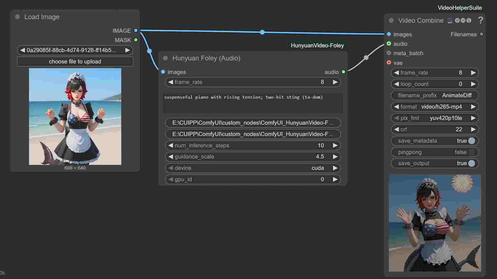

# ComfyUI HunyuanVideo-Foley Custom Node



This custom node integrates the HunyuanVideo-Foley model for generating audio from video frames and text prompts in ComfyUI. It's built for use in generating Foley sounds from video and text inputs.

Here’s the updated `## Installation` section:

---

## Installation

### Step 1: Set Up Your Custom Node

1. **Navigate to the custom\_nodes directory**:

   ```bash
   cd custom_nodes
   ```

2. **Clone this project (ComfyUI HunyuanVideo-Foley)**:

   ```bash
   git clone https://github.com/dasilva333/ComfyUI_HunyuanVideo-Foley.git
   ```

3. **Navigate into the cloned custom node directory**:

   ```bash
   cd ComfyUI_HunyuanVideo-Foley
   ```

### Step 2: Clone HunyuanVideo-Foley Repository

4. **Clone the HunyuanVideo-Foley repository into your node folder**:

   ```bash
   git clone https://huggingface.co/tencent/HunyuanVideo-Foley
   ```

5. **Navigate into the HunyuanVideo-Foley directory**:

   ```bash
   cd HunyuanVideo-Foley
   ```

6. **Install the required dependencies**:

   ```bash
   pip install -r requirements.txt
   ```

### Step 3: Clone the Pretrained Model

7. **Clone the pretrained model inside the HunyuanVideo-Foley folder**:

   * Follow the instructions on the official [HunyuanVideo-Foley HuggingFace page](https://huggingface.co/tencent/HunyuanVideo-Foley) to download the model and place it inside this folder.


---

## Usage

### Loading the Custom Node in ComfyUI

1. Once you’ve set up the repository and placed your models, open ComfyUI.
2. In the Node Graph interface, look for the `Hunyuan Foley (Audio)` node under the custom nodes section.
3. You can connect this node to the rest of your pipeline, providing it with video frames (via `Load Image` or `Load Video` nodes) and a text prompt.

### Input Requirements

* **Frames**: The input frames can come from `Load Image`, `Load Video`, or other nodes that produce frames in the form of a tensor (e.g., VAE Decode).
* **Audio Prompt**: The node requires a text prompt (e.g., “suspenseful piano with rising tension”) to generate audio.
* **Frame Rate**: Specify the frame rate of the input frames (e.g., `8.0` fps).

### Example Workflow

You can test the node with a sample workflow JSON. Download the sample JSON file and try it out to see how the node functions in a typical use case.

---

## Troubleshooting

### Out of Memory (OOM) Errors

* **Problem**: If you get an OOM error while processing, it likely means your GPU does not have enough memory to process the given video frames.
* **Solution**:

  * Downscale the input video frames.
  * Reduce the number of inference steps or batch size.
  * Use smaller model sizes if available.

### Missing FFmpeg Executables

* **Problem**: If you encounter errors related to missing FFmpeg executables, it's likely that the necessary FFmpeg binaries are not present in your `python_embedded` directory.
* **Solution**:

  * Download the FFmpeg essentials and place the binaries in your `python_embedded` folder. You can download FFmpeg from the official site: [FFmpeg Downloads](https://ffmpeg.org/download.html).
  * Ensure that the executable files (`ffmpeg`, `ffprop`, etc.) are available in the correct directory.

### Silent Audio Output

* **Problem**: Sometimes the DAC model might return an all-zero waveform.
* **Solution**: Check the `guidance_scale` and ensure the text prompt is sufficient to guide the generation process. Adjust the prompt if necessary to achieve more diverse results.

---

## Important Notes

* **VRAM**: The model was tested on a GPU with 8GB of VRAM. For 10 inference steps, expect processing times around 4 minutes 5 seconds.
* **Device Compatibility**: The node requires a CUDA-capable GPU for efficient inference, but it can fall back to CPU if necessary (though performance will be significantly slower).

---

## Contributing

Feel free to open issues or contribute to the repository if you have suggestions or improvements. Pull requests are always welcome!

---

## License

This project is licensed under the MIT License - see the [LICENSE](LICENSE) file for details.
